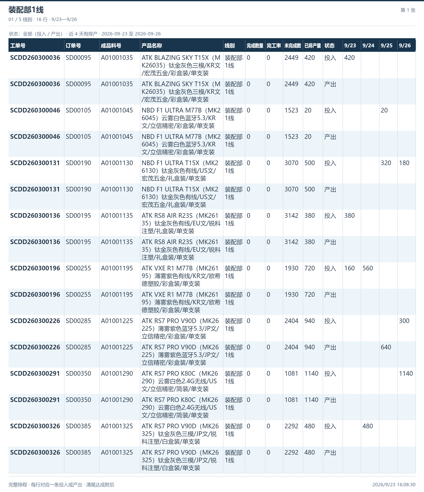
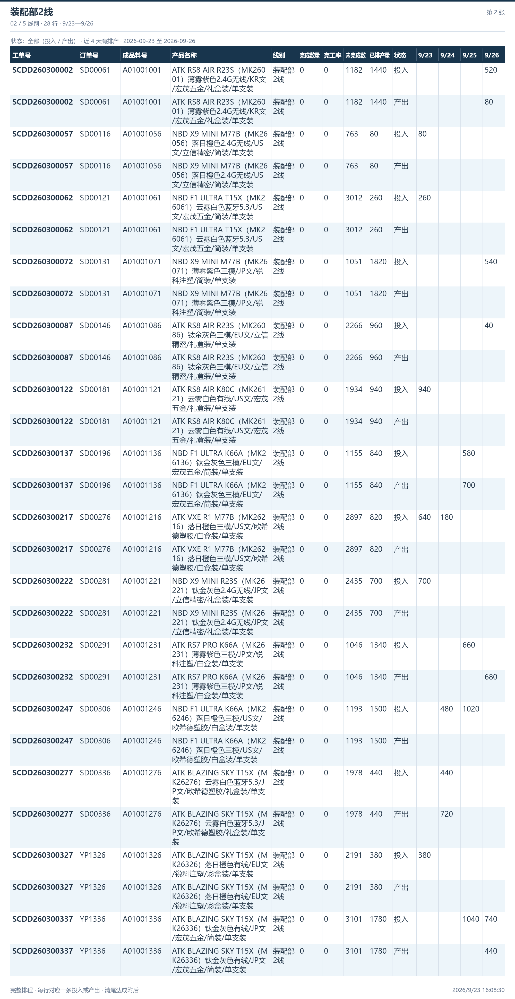
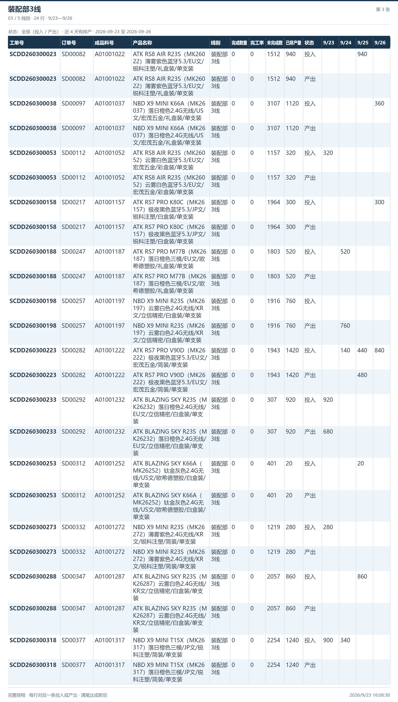
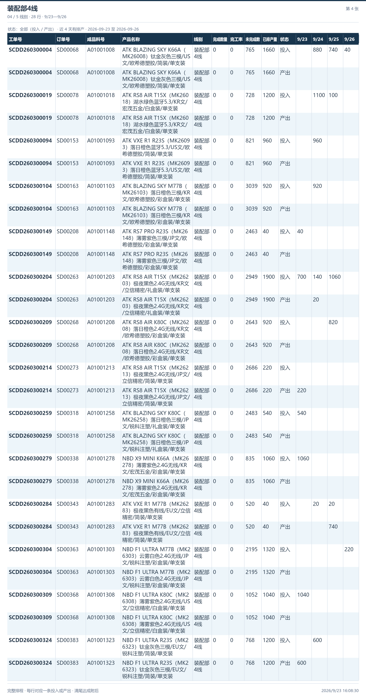
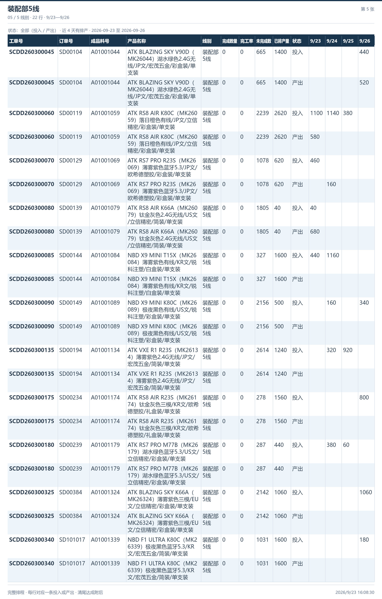
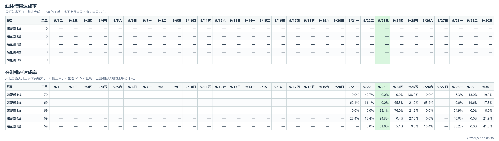

# 排程图片

本批图片来自 PMC 本机示例页，状态为全部，日期为 2026-09-23 至 2026-09-26，共 118 行。

按序保存五张部门排程和一张完整清尾达成图。图片由项目同一套渲染代码生成。

## 01 装配部1线-排程

## 02 装配部2线-排程

## 03 装配部3线-排程

## 04 装配部4线-排程

## 05 装配部5线-排程

## 06 清尾达成

